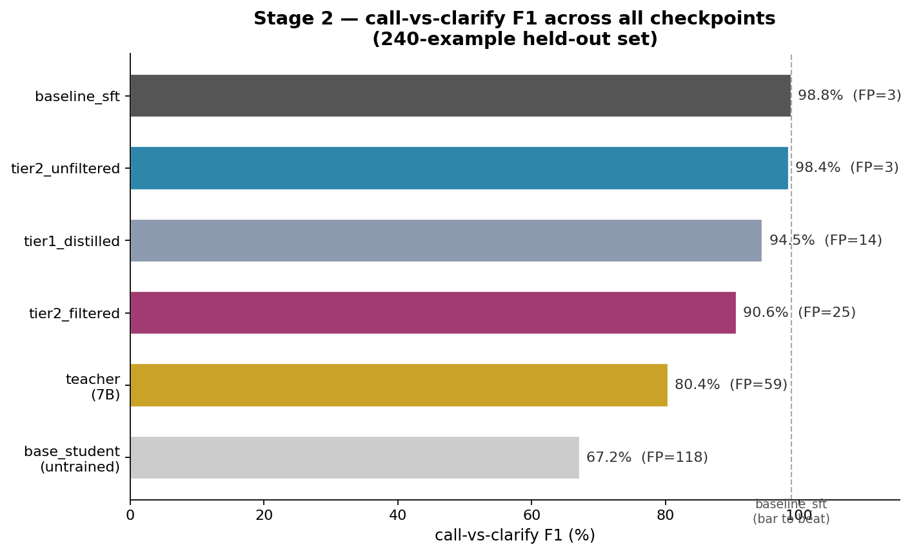

# Stage 2 — Distillation

**Status:** Tier 1 and Tier 2 complete. Tier 3 (on-policy GKD) next.

Full walkthrough: [`docs/stage2_distillation_guide_5090mobile.md`](../docs/stage2_distillation_guide_5090mobile.md)
Live checklist: [`PROGRESS.md`](../PROGRESS.md)

## Goal

Take a large, capable **teacher** and compress its behavior into a small, cheap
**student** that runs fast in the existing llama.cpp stack — then prove, with
a scriptable eval, that distillation beats plain SFT at the same student size.

Distillation is treated as "SFT plus a teacher signal": Tier 1 reuses Stage
1's SFT machinery directly; Tier 2 reuses the same held-out eval harness.

## Headline result

`tier2_unfiltered` (offline logit KD, full unfiltered training split) closes
the gap to `baseline_sft` almost completely — 98.4% vs. 98.8% F1, tied on
false positives — while carrying genuine distributional signal that plain
SFT structurally cannot access. `tier1_distilled` (sequence-level KD) beats
the teacher decisively but can't beat SFT, by construction (see Track B
below). `tier2_filtered` underperforms for a specific, diagnosed reason, not
by chance. Full numbers and diagnosis in `PROGRESS.md`.

## Environments

Two separate venvs, each isolating a toolkit's own pinned dependencies from
the others:

| Venv | Used for | Key versions |
|---|---|---|
| `.venv-distill` | Track A, Tier 1, Tier 3 (TRL `GKDTrainer`) | torch 2.11.0+cu128, bitsandbytes 0.49.2, transformers 5.13.0, **trl 1.7.0** |
| `.venv-distill-tier2` | Tier 2 (DistillKit) | torch 2.11.0+cu128, bitsandbytes 0.49.2, transformers 5.13.0, **trl 0.25.1** (DistillKit's own pin) |

**Why two venvs:** DistillKit's install resolves `trl` down to 0.25.1,
overwriting the Phase-0-gated 1.7.0 that Tier 3's `GKDTrainer` needs. Same
isolation principle as the Stage 1 (`.venv-ft`) / Stage 2 (`.venv-distill`)
split, applied one level deeper.

Lockfiles: [`../requirements.distill.lock`](../requirements.distill.lock) (Tier 1/3 env), `requirements.distill-tier2.lock` (Tier 2 env)

**Phase 0 gate** (`phase0_distill_gate.py`) confirmed before any Tier 1/3 trainer code was written:
- `GKDConfig`/`GKDTrainer` import from `trl.experimental.gkd` on this TRL version
- `GKDConfig` uses `max_length` (not `max_seq_length`)
- `lmbda`/`beta`/`seq_kd` all present on `GKDConfig`
- `TRL_EXPERIMENTAL_SILENCE=1` set in `.venv-distill/bin/activate`

## Model pairing

| Role | Model | Why |
|---|---|---|
| Teacher | `Qwen/Qwen2.5-7B-Instruct` (4-bit NF4) | Strong at tool-calling; shares tokenizer lineage with small Qwen students |
| Student | `Qwen/Qwen2.5-0.5B-Instruct` | Matches teacher's chat-template tokenizer; small enough to fully fine-tune |
| Task | `hiyouga/glaive-function-calling-v2-sharegpt` | Same throughline as Stage 1; scriptable eval already exists |

**Gotcha resolved during Track A, re-confirmed in Tier 2:** Qwen2.5
checkpoints pad the `lm_head`/embedding matrix to different widths **by
model size**, independent of base-vs-instruct — the 0.5B pads to
`vocab_size=151936`, the 7B pads to `152064`, though the real tokenizer
vocab (`len(tokenizer)`) is smaller than both (~151,665) and identical
across the family. Any logit-KD code truncates both teacher and student
logits to `len(tokenizer)` before computing KL/decompressing — see
`kd_loss_scratch.py` (Track A) and `capture_teacher_logits.py` (Tier 2) for
the pattern.

## Track A — from scratch (done)

`kd_loss_scratch.py` hand-implements the Hinton KD loss
(`alpha·KL(student‖teacher) + (1−alpha)·CE`), does one real teacher+student
forward pass on the Qwen pair, sweeps `T ∈ {1,2,4} × alpha ∈ {0,0.5,0.9}`
read-only, then runs one real training step at `T=2.0, alpha=0.5`.

Key lesson: the `T²` rescale exists to keep gradient magnitudes comparable
across temperatures, not to shrink the reported loss — its net effect
depends on the tradeoff against the raw KL shrinkage from softening the
distributions.

## Track B — the four tiers

| Tier | Method | Status |
|---|---|---|
| **1** | Sequence-level KD — teacher generates completions offline, student does plain SFT on them | ✅ done |
| **2** | Offline logit KD via DistillKit — teacher's top-k logits captured to disk (plain `transformers` forward pass, not vLLM — see below), student trained with teacher never co-resident | ✅ done |
| **3** | Online on-policy KD via TRL `GKDTrainer` — student generates, teacher scores, fixes exposure bias | ⏳ next |
| **4** (stretch) | Cross-tokenizer distillation via GOLD/ULD | ⏳ optional |

**Tier 1 result:** on the clean `call_vs_clarify` metric, tier1_distilled
beat its own teacher decisively (94.5% F1 vs. teacher's 80.4%) but could not
beat baseline_sft (98.8%) — sequence-level KD is mechanically "SFT on a
different label set," so it structurally cannot beat training on an
already-clean original label. This motivated Tier 2.

**Tier 2 — why not vLLM for logit capture:** DistillKit's reference capture
script (`sample_logits_vllm.py`) requires vLLM, whose current PyPI default
wheel is linked against CUDA 13 (as of v0.20.0) — incompatible with this
project's CUDA-12.8-pinned stack. Rather than fight vLLM's build system, we
wrote a small standalone capture script (`capture_teacher_logits.py`) using
a plain `transformers` forward pass — DistillKit's actual storage/compression
format (`LogprobCompressor`, `StreamingParquetWriter`, in
`distillkit.compression`/`distillkit.sample_common`) has no vLLM dependency;
only the optional fast-generation capture path does.

**Tier 2 result:** tier2_unfiltered (trained on the full, unfiltered
2760-example split) reached 98.4% call-vs-clarify F1, essentially matching
baseline_sft's 98.8% — the first tier to close the gap to clean-label SFT
while still carrying genuine distributional signal. A second run on the
Tier-1-style filtered split (2157 examples) underperformed (90.6% F1) with a
clear mechanistic explanation: that filter removes clarify-required examples
disproportionately, since those are the ones the teacher was likely to get
wrong — teaching the filtered student a miniature version of the teacher's
own over-calling bias. **Unfiltered data is the right choice for logit-level
KD on this task.** Full writeup in `PROGRESS.md`.

## Evaluation

`score_students_tier2.py` (exact_args, 3-level scoring) and
`score_call_vs_clarify_tier2.py` (binary F1) extend the original Tier 1
scripts (kept unchanged and independently re-runnable) with the two Tier 2
checkpoints, scoring all six models — base_student, baseline_sft,
tier1_distilled, tier2_unfiltered, tier2_filtered, teacher — on the same
untouched 240-example held-out split.

`diagnose_tier2_misses.py` extends the Tier 1 miss-diagnostic pattern with
an automatic overlap check against baseline_sft's misses, to distinguish a
real capability gap from an inherited scoring-convention artifact before
trusting any headline exact_args number.

**call_vs_clarify F1 is the metric that actually discriminates between
methods on this task** — exact_args is flat across every student variant
(diagnosed as inherited dataset-labeling-convention artifacts, not
capability differences) and should not be used alone to judge a distillation
method here.

## Export

Tier 1 checkpoints (Unsloth-trained) use `export_gguf.py` (Unsloth's
`save_pretrained_gguf()`). **Tier 2 checkpoints are plain `transformers`-saved
full models with no LoRA adapter**, so they use llama.cpp's own
`convert_hf_to_gguf.py` + `llama-quantize` directly instead. Served through
the project's own GPU-enabled llama.cpp build (not Unsloth's CPU-only drop).

## Known gap: Tier 2 training loss curves weren't fully logged

Both Tier 2 training runs (`distillkit -v tier2_config_*.yaml`) were piped
directly to the terminal rather than `tee`'d to a file, and the terminal's
scrollback buffer didn't retain the full run — only the first ~15 steps of
`tier2_unfiltered` and the last ~30 steps of `tier2_filtered` survived,
two non-overlapping windows that can't be honestly compared or plotted.
**Fix applied going forward:** all `distillkit` invocations now pipe through
`tee run.log` so the full step-by-step history is preserved regardless of
terminal buffer limits. If a loss-curve comparison plot is wanted later, a
quick re-run with `tee` (training itself doesn't need to change) would
produce one; not worth fabricating from the partial data on hand.

## Next: Tier 3 (GKD)

`.venv-distill` (with trl 1.7.0) was preserved specifically for this —
`GKDTrainer` needs the on-policy student-generates/teacher-scores loop,
fixing the exposure bias that both Tier 1 and Tier 2 (both off-policy) share
in principle, even though Tier 2's soft targets already closed most of the
practical gap to SFT on this task.

## Next: Stage 4 capstone thread

A strong function-calling student here makes function calling the natural
capstone domain (pretrain a small base → distill toward function calling →
fine-tune) — worth keeping in mind when Stage 3's pretraining dataset choices
come up.
